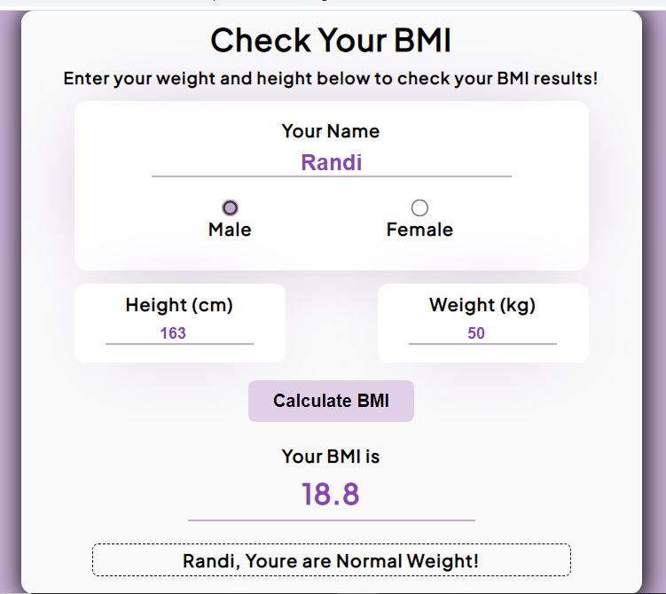
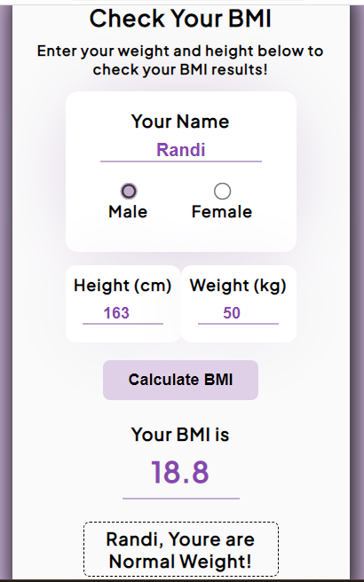

# BMI Calculator
Body Mass Index (BMI) is an easy calculation method that can provide basic information on your overall weight problem. This number can act as a warning sign of danger and protect a person from dying from obesity-related chronic diseases.

## Specs
1. Create a website application to calculate Body Mass Index (BMI) based on predetermined standards.
2. The user must enter data on body weight in KG
3. The user must enter height data in CM
4. The BMI formula for KG and CM units is body weight/(height/100)^2
5. The application must display the BMI status according to the following standards:

## BMI category:
* Underweight = <18.5
* Normal weight = 18.5 – 24.9
* Overweight = 25 – 29.9
* Obesity = BMI 30 or more

## Structure HTML
```html
<!DOCTYPE html>
<html lang="en">
    <head>
        <meta charset="UTF-8">
        <meta http-equiv="X-UA-Compatible" content="IE=edge">
        <meta name="viewport" content="width=device-width, initial-scale=1.0">
        <title>Body Mass Index</title>
        <link rel="stylesheet" href="style.css">
    </head>
    <body>
        <div class="container">
            <div class="box">
                <h1>Check Your BMI</h1>
                <h3>Enter your weight and height below to check your BMI results!</h3>

                <div class="content">

                    <!-- Input Name -->
                    <div class="name">
                        <label for="name">Your Name</label>
                        <input type="text" class="name-input" id="nameinput" required>

                        <!-- Select Gender -->
                        <div class="select-gender">
                                <label for="male">
                                    <input type="radio" name="radio" id="g-male"><p class="select-mf">Male</p>
                                </label>
            
                                <label for="female">
                                    <input type="radio" name="radio" id="g-female"><p class="select-mf">Female</p>
                                </label>
                        </div>
                        <!-- End Select Gender -->
                    </div>
                    <!-- End Input Name -->

                    <!-- For Input Height & Weight -->
                    <div class="heightweight">

                        <div class="inputH">
                            <label for="height">Height (cm)</label>
                            <input type="number" id="height" required>
                        </div>

                        <div class="inputW">
                            <label for="weight">Weight (kg)</label>
                            <input type="number" id="weight" required>
                        </div>

                    </div>
                    <!-- End Input Height & Weight -->

                    <!-- Button Calculate -->
                    <div>
                        <button class="calculate" id="submit" onclick="calculate()">Calculate BMI</button>
                    </div>
                    <!-- End Button Calculate -->

                    <!-- Result -->
                    <div class="result">
                        <p>Your BMI is</p>
                        <div id="Cresult">00.00</div>
                        <p class="comment"></p>
                    </div>
                    <!-- End Result -->

                </div>

            </div>
        </div>

        <!-- PopUp -->
        <div id="myPopup" class="popup">
            <!-- PopUp content -->
            <div class="popup-content">
                <span class="close">&times;</span>
                <p id="popupText"></p>
            </div>
        </div>
        <!-- End PopUp -->
        
        <script src="script.js"></script>
    </body>
</html>
```
## CSS Style
```css
@import url('https://fonts.googleapis.com/css2?family=Plus+Jakarta+Sans:wght@300;400;500&display=swap');

* {
    margin: 0;
    padding: 0;
    box-sizing: border-box;
    font-family: 'Plus Jakarta Sans', sans-serif;
}

body {
    display: flex;
    align-items: center;
    justify-content: center;
    min-height: 100vh;
    background-color: #C3ACD0;
}

.box {
    text-align: center;
    width: 700px;
    background-color: #fafafa;
    border-radius: 14px;
    box-shadow: 2px 2px 25px 5px rgba(0,0,0,0.8);
    letter-spacing: 1px;
}

h1 {
    padding: 10px 0;
    font-size: 35px;
    color: black;
}

h3 {
    margin-bottom: 15px;
    color: black;
    
}

.content {
    padding: 0px 60px;
}

/* Input Name */
.name {
    background-color: #fff;
    padding-top: 20px;
    padding-bottom: 15px;
    margin-bottom: 15px;
    border-radius: 14px;
    box-shadow: 0px 0px 95px -30px #C3ACD0;
}

.name label {
    display: block;
    font-size: 20px;
    font-weight: 600;
    color: black;
    margin-bottom: 10px;
}

.name input {
    outline: none;
    border: none;
    border-bottom: 2px solid #C3ACD0;
    width: 70%;
    text-align: center;
    font-family: "Nunito", sans-serif;
    font-size: 25px;
    color: #8946af;
    font-weight: bold;
    margin-bottom: 20px;
}
/* End Input Name */

/* Style Select Gender */
.select-gender {
    display: flex;
    align-items: center;
    justify-content: space-evenly;
    color: black;
    accent-color: #C3ACD0;    
    font-size: 18px;
    font-weight: 600;
    
}

input[type="radio"] {
    margin: 0;
    -webkit-transform: scale(1.5);
    transform: scale(1.5);
    cursor: pointer;
}

.select-mf{
    padding-bottom: 10px;
}
/* End Style Select Gender */

/* Style Height Weight */ 
.heightweight {
    display: flex;
    justify-content: space-between;
    align-items: center;
}

.inputH {
    background-color: #fff;
    box-shadow: 0px 0px 95px -30px #C3ACD0;
    border-radius: 12px;
    padding: 10px 0;
    margin-bottom: 20px;
}

.inputH label {
    display: block;
    font-size: 20px;
    font-weight: 600;
    color: #000;
    margin-bottom: 10px;
}

.inputH input {
    outline: none;
    border: none;
    border-bottom: 2px solid #C3ACD0;
    width: 70%;
    text-align: center;
    font-family: "Nunito", sans-serif;
    font-size: 18px;
    font-weight: bold;
    color: #8946af;
    margin-bottom: 10px;
}

.inputW {
    background-color: #fff;
    box-shadow: 0px 0px 95px -30px #C3ACD0;
    border-radius: 12px;
    padding: 10px 0;
    margin-bottom: 20px;
}

.inputW label {
    display: block;
    font-size: 20px;
    font-weight: 600;
    color: #000;
    margin-bottom: 10px;
}

.inputW input {
    outline: none;
    border: none;
    border-bottom: 2px solid #C3ACD0;
    width: 70%;
    text-align: center;
    font-family: "Nunito", sans-serif;
    font-size: 18px;
    color: #8946af;
    font-weight: bold;
    margin-bottom: 10px;
}
/* End Style Height Weight */

/* Style Button */
button.calculate {
    font-size: 20px;
    font-weight: 600;
    font-family: "Nunito", sans-serif;
    color: black;
    cursor: pointer;
    background:#dfd0e7;
    border-radius: 8px;
    padding: 12px 28px;
    display: inline-block;
    outline: none;
    border: none;
    transition: all 0.5s;
}

button.calculate:hover {
    background: #C3ACD0;
}
/* Style Button */

/* Result */
.result {
    padding: 10px 20px;
}

.result p {
    font-weight: 600;
    font-size: 20px;
    color: black;
    margin-top: 15px;
}

.result #Cresult {
    font-size: 32px;
    font-weight: 999;
    color: #8946af;
    display: inline-block;
    padding: 10px 0;
    border-bottom: 2px solid #C3ACD0;
    width: 60%;
    margin-bottom: 10px;
  }
/* End Result */

/* Comment */
.comment {
    display: none;
    border: dashed 1px;
    border-radius: 7px;
    padding: 5px;
    font-weight: 800;
    margin-bottom: 10px;
}
/* End Comment */

/* PopUp */
.popup {
    display: none;
    position: fixed;
    z-index: 1;
    padding-top: 100px;
    left: 0;
    top: 0;
    width: 100%;
    height: 100%;
    overflow: auto;
    background-color: rgb(0,0,0);
    background-color: rgba(0,0,0,0.4);
    padding-top: 300px;
  
  }

.popup-content {
    background-color: #fefefe;
    margin: auto;
    padding: 20px;
    border: 2px solid #C3ACD0;
    width: 600px;
    border-radius: 10px;
    box-shadow: 2px 2px 25px 5px rgba(0,0,0,0.8);
}
  
#popupText {
    padding-top: 8px;
    padding-right: 5px;
    font-size: 18px;
    font-family: 'Poppins', sans-serif;
    color: rgb(24, 23, 23);
}

/* End PopUp */
  
/* The Close Button */
.close {
    color: #aaaaaa;
    float: right;
    font-size: 28px;
    font-weight: bold;
    cursor: pointer;
    transition: all 0.3s;
}
  
.close:hover {
    color: black; 
}
/* End The Close Button */

/* Responsive */
@media (max-width: 700px){
    
    .box {
        width: 380px;
    }

    .box h1 {
        font-size: 26px;
    }

    .box h3 {
        font-size: 16px;
        padding-left: 15px;
        padding-right: 15px;
    }

    .input label {
        font-size: 18px;
    }

    .name input {
        font-size: 20px;
    }

    .inputH label, .inputW label {
        font-size: 18px;
    }

    .input input, .inputH input, .inputW input{
        font-size: 18px;
    }

    .select-gender label {
        font-size: 18px;
    }

    button.calculate {
        font-size: 18px;
    }

    .popup-content {
      width: 380px;
    }

}
/* End Responsive */
```

## Created in Javascript
```javascript
let yourName = document.getElementById("nameinput");
let male = document.getElementById("g-male");
let female = document.getElementById("g-female");
let height = document.getElementById("height");
let weight = document.getElementById("weight");
let resultComment = document.querySelector(".comment");

popupContent = document.querySelector(".popup-content");
popupText = document.querySelector("#popupText");
let popup = document.getElementById("myPopup");
let spanClose = document.getElementsByClassName("close")[0];

function calculate() {
    if(yourName.value=='' || height.value=='' || weight.value=='' || (male.checked==false && female.checked==false)) {
        popup.style.display = "block";
        popupText.innerHTML = `Check your data again and please fill in all the fields!`;
    } else {
        submitBmi();
    }
}

spanClose.onclick = function() {
    popup.style.display = "none";
}

window.onclick = function(event) {
    if (event.target == popup) {
        popup.style.display = "none";
    }
}

function submitBmi() {
    let p = [yourName.value, height.value, weight.value];
    if(male.checked){
      p.push("male");
    }else if(female.checked){
      p.push("female");
    }

    let bmi = Number(p[2])/(Number(p[1])/100*Number(p[1])/100);

    let result = '';
    if(bmi<18.5) {
        result = 'Underwight';
    } else if(18.5<=bmi&&bmi<=24.9) {
        result = 'Normal Weight';
    } else if(25<=bmi&&bmi<=29.9) {
        result = 'Overweight';
    } else if(30<=bmi) {
        result = 'Obesity';
    }

    resultComment.style.display = 'block';
    document.querySelector('.comment').innerHTML = yourName.value + `, Youre are ${result}!`;
    document.querySelector('#Cresult').innerHTML = bmi.toFixed(1);
}
```

## Output - BMI Calculator
* WEB Version  
;

* Mobile Version  
;

## Link Preview  
Click [Preview](https://calculatorbodymassindex.netlify.app/)
